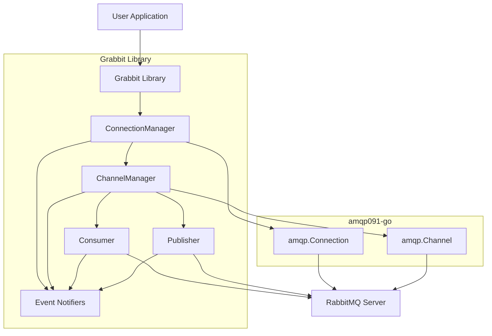

# Architecture

The "grabbit" library provides a robust, managed layer over the low-level `amqp091-go` RabbitMQ client library, focusing on auto-recovery, concurrency safety, and ease of use.

## System Architecture

The core components of the `grabbit` library are designed to abstract away the complexities of RabbitMQ interaction and provide resilient, managed resources.

### Main Components

*   **Connection Manager (`connection.go`, `connection_safebase.go`, `connection_safewrappers.go`, `connection_options.go`):**
    *   Responsible for establishing and maintaining a connection to the RabbitMQ server.
    *   Implements auto-recovery logic to re-establish the `amqp.Connection` in case of disconnections or server failures.
    *   Provides a concurrency-safe wrapper around the underlying `amqp.Connection`.
    *   Manages connection-level options.

*   **Channel Manager (`channel.go`, `channel_safebase.go`, `channel_safewrappers.go`, `channel_options.go`):**
    *   Manages the lifecycle and auto-recovery of `amqp.Channel` instances, which are derived from a managed connection.
    *   Ensures channels are re-opened and re-configured (including topology) upon connection recovery.
    *   Provides concurrency-safe access to `amqp.Channel` functionalities.
    *   Manages channel-level options.

*   **Consumers (`consumer.go`, `consumer_options.go`, `channel_consume.go`):**
    *   High-level abstraction for consuming messages from RabbitMQ queues.
    *   Allows users to register custom message handlers.
    *   Supports batch processing of messages with configurable QoS expectations and timeouts.
    *   Handles message acknowledgments and rejections.

*   **Publishers (`publisher.go`, `publisher_options.go`):**
    *   High-level abstraction for publishing messages to RabbitMQ exchanges.
    *   Supports deferred confirmations (`PublishDeferredConfirm`, `AwaitDeferredConfirmation`) to ensure message delivery.
    *   Manages publisher-level options, including routing.

*   **Eventing/Notifiers (`events.go`):**
    *   Provides a mechanism for the library to submit detailed internal events (e.g., connection/channel recovery, errors) in a non-blocking manner via a buffered channel.
    *   Offers an optional synchronous (blocking) callback mechanism for critical recovery events, allowing user applications to react immediately.

*   **Topology Definition (`topology_options.go`):**
    *   Consumers and publishers define their required RabbitMQ topology (exchanges, queues, bindings).
    *   This topology is declared upon initial channel creation and is automatically re-established during channel recovery for ephemeral resources.

### Component Relationships

## Key Technical Decisions and Design Patterns

*   **Wrapper/Facade Pattern:** The `grabbit` library acts as a facade over `amqp091-go`, simplifying its usage and adding resilience features.
*   **Manager Pattern:** Dedicated `ConnectionManager` and `ChannelManager` components encapsulate the complex logic of lifecycle management and auto-recovery.
*   **Concurrency Safety:** Extensive use of `sync.Mutex` and other Go concurrency primitives (evident in `_safebase.go` and `_safewrappers.go` files) to ensure thread-safe access to underlying `amqp` objects.
*   **Functional Options Pattern:** Configuration is handled through functional options (`With...` functions in `_options.go` files), providing a flexible and extensible way to customize component behavior.
*   **Event-Driven Internal Architecture:** Internal events are propagated through channels, allowing for decoupled monitoring and reaction within the library.
*   **Dependency Injection:** Higher-level components (Consumers, Publishers) are designed to accept managed channels as dependencies, promoting modularity and testability.

## Critical Implementation Paths

*   **Auto-Recovery Logic:** The precise sequence of operations for detecting disconnections, re-establishing connections, re-opening channels, and re-declaring topology is critical for reliability. This involves handling various error scenarios and race conditions.
*   **Concurrency Control:** The implementation of `_safebase.go` and `_safewrappers.go` must be rigorously correct to prevent deadlocks, race conditions, and data corruption when multiple goroutines interact with `amqp` resources.
*   **Event Handling and Callbacks:** Ensuring that internal events are submitted non-blockingly and that synchronous callbacks are executed reliably without introducing performance bottlenecks or deadlocks.
*   **Deferred Confirmations:** The mechanism for tracking published messages and correlating them with `amqp.Confirmation` events to provide reliable publishing guarantees.
*   **Batch Consumption with QoS:** The logic for accumulating messages into batches, respecting QoS prefetch counts, and handling partial acknowledgments or rejections within a given timeout.